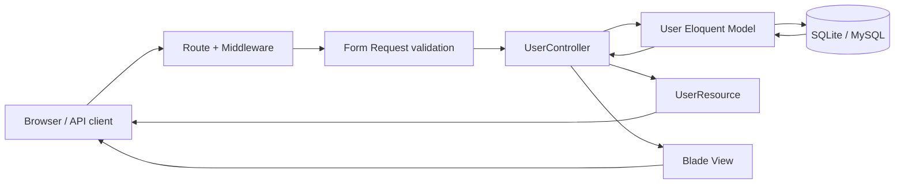

# Laravel User Manager

Навчальний, але повністю робочий проєкт на **Laravel 13.21.1** і PHP 8.3. Він містить:

- реєстрацію, вхід, вихід, відновлення пароля та профіль на Laravel Breeze;
- session-автентифікацію для браузера і Laravel Sanctum для API;
- захищений RESTful CRUD API користувачів;
- Form Request-валідацію та API Resource-відповіді;
- Blade + Tailwind CSS інтерфейс з AJAX-запитами;
- SQLite, пагінацію, кешування, інвалідацію кешу, транзакції й логування;
- 36 автоматизованих тестів, з них 11 спеціально для API;
- production checklist і health endpoint `/up`.

## Швидкий запуск

### Передумови

- PHP 8.3 або новіший;
- Composer 2;
- Node.js 20+ та npm;
- PHP-розширення: `ctype`, `curl`, `fileinfo`, `mbstring`, `openssl`, `pdo_sqlite`, `tokenizer`, `xml`.

### Встановлення

```bash
git clone <URL-ВАШОГО-РЕПОЗИТОРІЮ> laravel-user-manager
cd laravel-user-manager
composer setup
composer run dev
```

`composer setup` — це готовий script із `composer.json`. Він:

1. встановлює PHP-залежності;
2. копіює `.env.example` у `.env`, якщо `.env` ще немає;
3. генерує унікальний `APP_KEY`;
4. запускає міграції;
5. встановлює npm-пакети;
6. збирає frontend.

Відкрийте `http://localhost:8000/register`, зареєструйтеся і перейдіть до
`/users`.

На Windows, якщо PowerShell блокує `npm.ps1`, використовуйте `npm.cmd`:

```powershell
npm.cmd install
npm.cmd run build
php artisan serve
```

## Крок 1. Репозиторій та ініціалізація

### Що було виконано

Каркас створено Composer-командою:

```bash
composer create-project laravel/laravel laravel-user-manager "^13.0"
```

Після цього проєкт стає незалежним застосунком: `laravel/framework` є
залежністю, а наш код живе у `app`, `routes`, `resources`, `database` і
`tests`.

Базовий Git workflow:

```bash
git init
git add .
git commit -m "Build Laravel user manager"
git branch -M main
git remote add origin https://github.com/USERNAME/laravel-user-manager.git
git push -u origin main
```

### Чому Composer

Composer вирішує дерево PHP-залежностей, фіксує точні версії у
`composer.lock` та будує PSR-4 autoload. Тому інший розробник отримує той самий
набір пакетів командою `composer install`.

Не плутайте:

- `composer install` використовує вже зафіксований `composer.lock`;
- `composer update` шукає нові дозволені версії й змінює lock-файл;
- у CI та production майже завжди потрібен `composer install`.

### Основні директорії та файли

| Шлях | Призначення |
|---|---|
| `app/` | Бізнес-код: controllers, models, middleware, requests, resources, observers |
| `bootstrap/app.php` | Збірка застосунку, реєстрація маршрутів, middleware та exception handling |
| `config/` | Конфігурація сервісів; читає значення середовища через `env()` |
| `database/migrations/` | Версіонована схема БД |
| `database/factories/` | Генератори тестових моделей |
| `public/` | Єдиний web root; містить `index.php` і скомпільовані assets |
| `resources/views/` | Blade-шаблони |
| `resources/js/`, `resources/css/` | Frontend-вихідні файли |
| `routes/web.php` | Stateful web-маршрути із sessions і CSRF |
| `routes/api.php` | API-маршрути з префіксом `/api` |
| `storage/` | Логи, кеш, сесії, скомпільовані views та runtime-файли |
| `tests/` | Unit і feature tests |
| `vendor/` | Composer-залежності; не комітиться |
| `.env` | Секрети та локальні параметри; не комітиться |
| `.env.example` | Безпечний шаблон змінних; комітиться |
| `artisan` | CLI Laravel |
| `composer.json` | PHP-залежності, autoload і scripts |
| `package.json` | Frontend-залежності та Vite scripts |

Офіційно: [Directory Structure](https://laravel.com/docs/13.x/structure) і
[Installation](https://laravel.com/docs/13.x/installation).

## Крок 2. Середовище та база даних

Локальний `.env` має такі ключові значення:

```dotenv
APP_NAME="Laravel User Manager"
APP_ENV=local
APP_KEY=base64:... # кожна інсталяція генерує власний ключ
APP_DEBUG=true
APP_URL=http://localhost:8000

DB_CONNECTION=sqlite
SESSION_DRIVER=database
CACHE_STORE=database
QUEUE_CONNECTION=database
```

Порожній SQLite-файл створюється так:

```bash
# Linux/macOS
touch database/database.sqlite

# Windows PowerShell
New-Item -ItemType File database/database.sqlite
```

Міграції:

```bash
php artisan migrate
php artisan migrate:status
```

Міграція — це версія схеми БД у PHP. Метод `up()` застосовує зміну, `down()`
відкочує її. Це надійніше за ручне редагування таблиць: історія схеми живе у
Git і однаково відтворюється локально, у тестах та production.

### Як працює конфігурація

Потік значення такий:

```text
.env → config/*.php → config('ключ') → код застосунку
```

Наприклад, `config/users.php` читає `USERS_CACHE_TTL`, а контролер читає
`config('users.cache_ttl')`. Не викликайте `env()` напряму з controller:
production-команда `php artisan config:cache` завантажує `.env` лише під час
побудови кешу конфігурації.

Корисні команди:

```bash
php artisan config:show database
php artisan config:clear
php artisan config:cache   # production
```

### SQLite чи MySQL/PostgreSQL

**SQLite** не потребує сервера, ідеальна для навчання, тестів та одного
невеликого інстансу. Недолік — обмежена конкурентність запису й незручне
масштабування між кількома серверами.

Для production із багатьма одночасними записами краще PostgreSQL або MySQL:

```dotenv
DB_CONNECTION=mysql
DB_HOST=127.0.0.1
DB_PORT=3306
DB_DATABASE=laravel_user_manager
DB_USERNAME=app_user
DB_PASSWORD=change-me
```

Застосунковий код міняти не треба: Eloquent абстрагує драйвер.

Офіційно: [Configuration](https://laravel.com/docs/13.x/configuration),
[Database](https://laravel.com/docs/13.x/database) і
[Migrations](https://laravel.com/docs/13.x/migrations).

## Крок 3. Аутентифікація

Встановлені пакети:

```bash
composer require laravel/breeze --dev
php artisan breeze:install blade
php artisan install:api
```

Breeze копіює код у сам застосунок. Це важливо для навчання: controllers,
requests, routes і Blade views можна читати та змінювати. Реєстрація, login,
logout, reset password і profile вже покриті feature tests у `tests/Feature/Auth`.

### Що відбувається під час login

1. `POST /login` потрапляє в `AuthenticatedSessionController`.
2. `LoginRequest` перевіряє credentials і rate limit.
3. Laravel порівнює password із bcrypt-хешем — plaintext password у БД не
   зберігається.
4. Після успіху ID користувача записується у server-side session.
5. Браузер отримує cookie лише з session ID.
6. На наступному запиті `auth` відновлює користувача через configured provider.

**Guard** визначає, як запит автентифікується. **Provider** визначає, звідки
завантажується користувач. За замовчуванням web guard використовує session, а
Eloquent provider — `App\Models\User`.

### Middleware

Middleware — послідовні фільтри навколо controller:

```text
Request → cookies → session → CSRF → auth → user.auth → controller → Response
```

У `bootstrap/app.php` alias `user.auth` вказує на
`EnsureAuthenticatedUser`. Цей навчальний middleware:

- пропускає лише запит із `$request->user()`;
- логує неавторизовану спробу;
- є точкою для майбутньої role/permission-перевірки.

Для API використовується `auth:sanctum`. Sanctum приймає first-party session
для AJAX і Bearer token для зовнішнього клієнта. Не слід писати власну token
систему, якщо Sanctum уже вирішує задачу безпечніше.

Альтернативи:

- **Jetstream** — більше функцій (2FA, sessions, teams), але більше коду й
  складніший старт;
- **Laravel starter kits / Fortify** — сучасні повні stacks або headless auth;
- **Passport** — OAuth2, потрібен для сторонніх OAuth clients, але надмірний
  для цього застосунку.

Офіційно: [Authentication](https://laravel.com/docs/13.x/authentication),
[Middleware](https://laravel.com/docs/13.x/middleware) і
[Sanctum](https://laravel.com/docs/13.x/sanctum).

## Крок 4. REST API та MVC

Маршрути оголошені одним resource-виразом:

```php
Route::middleware(['auth:sanctum', 'user.auth', 'throttle:60,1'])
    ->name('api.')
    ->group(function (): void {
        Route::apiResource('users', UserController::class);
    });
```

Це генерує п'ять потрібних операцій:

| Method | URL | Controller | Результат |
|---|---|---|---|
| GET | `/api/users` | `index` | Пагінований список |
| POST | `/api/users` | `store` | Створення, HTTP 201 |
| GET | `/api/users/{user}` | `show` | Один користувач |
| PUT/PATCH | `/api/users/{user}` | `update` | Оновлення |
| DELETE | `/api/users/{user}` | `destroy` | Видалення, HTTP 204 |

Повні payloads, responses, статуси та cURL-приклади:
[docs/API.md](docs/API.md).

### MVC і додаткові HTTP-шари



- **Model** (`User`) представляє дані й Eloquent-поведінку.
- **View** (`users/index.blade.php`) відповідає за HTML.
- **Controller** координує use case, але не містить HTML.
- **Form Request** ізолює authorize + validation.
- **Resource** визначає публічну JSON-схему та не допускає витоку password.

`User $user` у controller — implicit route model binding. Laravel бере `{user}`
з URL, виконує пошук за primary key і автоматично повертає 404, якщо запису
немає.

Чому не повертати model напряму? Resource робить API contract явним:
перейменування внутрішнього поля або додавання секретного атрибута до model не
змінить response випадково.

Офіційно: [Controllers](https://laravel.com/docs/13.x/controllers),
[Validation](https://laravel.com/docs/13.x/validation),
[Eloquent](https://laravel.com/docs/13.x/eloquent) і
[API Resources](https://laravel.com/docs/13.x/eloquent-resources).

## Крок 5. Blade, Tailwind і AJAX

`resources/views/layouts/app.blade.php` — базовий layout. Він містить `<head>`,
навігацію, `{{ $slot }}` для сторінки та `@stack('scripts')` для page-specific
assets.

`resources/views/users/index.blade.php` передає лише безпечні URL/CSRF дані.
`resources/js/users.js`:

- читає список через `GET /api/users`;
- створює через `POST`;
- оновлює через `PUT`;
- видаляє через `DELETE`;
- показує 422 validation errors;
- керує сторінками без full-page reload;
- створює текстові DOM-вузли через `textContent`, а не вставляє user data як
  HTML — це захист від XSS.

Кожен mutating AJAX-запит надсилає:

```js
headers: {
    Accept: 'application/json',
    'Content-Type': 'application/json',
    'X-CSRF-TOKEN': csrfToken,
}
```

`credentials: 'same-origin'` додає session cookie. CSRF token доводить, що
запит створила наша сторінка, а не сторонній сайт.

### Чому Blade

- сервер генерує готовий HTML, тож first render простий і SEO-friendly;
- `{{ $value }}` автоматично HTML-escape значення;
- layouts, components, slots, directives та authorization інтегровані з
  Laravel;
- менше client state, ніж у повному SPA.

Недолік: для дуже інтерактивного продукту Vue/React/Svelte можуть краще
структурувати client state. Компроміси — Livewire або Inertia.

Tailwind компілюється Vite:

```bash
npm run dev    # HMR у розробці
npm run build  # мінімізований production build
```

Офіційно: [Blade](https://laravel.com/docs/13.x/blade),
[Views](https://laravel.com/docs/13.x/views) і
[Vite](https://laravel.com/docs/13.x/vite).

## Крок 6. Тестування

Запуск:

```bash
composer test
# або
php artisan test
php artisan test tests/Feature/Api/UserApiTest.php
```

Тестове середовище з `phpunit.xml` використовує:

- SQLite `:memory:` — швидка ізольована БД;
- `CACHE_STORE=array`;
- `SESSION_DRIVER=array`;
- `QUEUE_CONNECTION=sync`;
- низький `BCRYPT_ROUNDS=4` лише для швидкості тестів.

`RefreshDatabase` перебудовує схему для тестового class. `Sanctum::actingAs`
створює authenticated API actor без тестування внутрішньої реалізації cookie.

Ефективний feature test має структуру Arrange–Act–Assert:

```php
// Arrange
$target = User::factory()->create();
Sanctum::actingAs(User::factory()->create());

// Act + Assert
$this->deleteJson("/api/users/{$target->id}")
    ->assertNoContent();

$this->assertDatabaseMissing('users', ['id' => $target->id]);
```

Тестуйте observable behavior, а не приватні methods. Для API важливі:

- HTTP status;
- response schema;
- database side effect;
- auth/authorization;
- validation boundary;
- відсутність sensitive fields;
- cache invalidation.

Unit tests швидкі й ізолюють чисту логіку. Feature tests повільніші, зате
перевіряють маршрут, middleware, validation, controller, database та response
разом. Для CRUD HTTP API feature tests дають найбільшу цінність.

Офіційно: [Testing](https://laravel.com/docs/13.x/testing),
[HTTP Tests](https://laravel.com/docs/13.x/http-tests) і
[Database Testing](https://laravel.com/docs/13.x/database-testing).

## Крок 7. Оптимізація та best practices

### Кешування

`UserController@index` кешує кожну комбінацію `page/per_page` на 60 секунд.
`UserObserver` після create/update/delete змінює version key. Новий read одразу
отримує новий cache key:

```text
users.index.{version}.page.{page}.per-page.{perPage}
```

Цей підхід працює з database/file/Redis cache і не залежить від cache tags.
Старі версії автоматично зникають за TTL.

Для великого production-навантаження Redis швидший за database cache:

```dotenv
CACHE_STORE=redis
SESSION_DRIVER=redis
```

### Пагінація й запити

API має default `10` і hard maximum `100`. Це захищає пам'ять і БД від
`GET /api/users?per_page=1000000`.

Query:

```php
User::query()
    ->select(['id', 'name', 'email', 'email_verified_at', 'created_at', 'updated_at'])
    ->latest('id')
    ->paginate($perPage);
```

Він не завантажує password/remember token. `users.email` має unique index,
primary key `id` уже індексований. Якщо пізніше з'являться relations, додавайте
eager loading (`with`) проти N+1.

Для дуже глибоких сторінок і великих таблиць розгляньте `cursorPaginate`:
швидше, але не дає звичайних номерів сторінок.

### Error handling і logging

- validation errors автоматично повертають 422 JSON;
- auth error — 401;
- route model binding — контрольований 404 без витоку model/database details;
- unhandled exceptions записує Laravel exception handler;
- create/update/delete логують `actor_id` та `user_id`, але не password;
- database writes виконуються в transactions.

Логи локально: `storage/logs/laravel.log`. У container/cloud краще
`LOG_CHANNEL=stderr`.

### PSR і безпека

- PSR-4 autoload описаний у `composer.json`;
- Laravel Pint нормалізує PSR-12/Laravel style: `vendor/bin/pint`;
- `.env`, `vendor`, `node_modules`, runtime logs і compiled assets не
  комітяться;
- passwords хешуються;
- Resource не повертає secrets;
- CSRF захищає session-based writes;
- API має `throttle:60,1`;
- SQL будується query builder/Eloquent із parameter binding.

Офіційно: [Cache](https://laravel.com/docs/13.x/cache),
[Pagination](https://laravel.com/docs/13.x/pagination),
[Logging](https://laravel.com/docs/13.x/logging) і
[Error Handling](https://laravel.com/docs/13.x/errors).

## Production deployment

Детальний checklist: [docs/DEPLOYMENT.md](docs/DEPLOYMENT.md).

Мінімальна послідовність:

```bash
composer install --no-dev --classmap-authoritative
npm ci
npm run build
php artisan migrate --force
php artisan optimize
```

Обов'язково:

1. document root web-сервера має бути `public/`, не корінь repository;
2. `APP_ENV=production`, `APP_DEBUG=false`;
3. згенеруйте production `APP_KEY` один раз і зберігайте як secret;
4. дайте PHP write-доступ лише до `storage/` і `bootstrap/cache/`;
5. використовуйте HTTPS, secure cookies і реальні mail/database credentials;
6. запускайте scheduler і queue workers під process manager;
7. перевіряйте `/up` load balancer-ом;
8. виконуйте `php artisan migrate --force` як контрольований release step.

## Корисні команди

```bash
php artisan about
php artisan route:list
php artisan migrate:status
php artisan test
vendor/bin/pint --test
php artisan optimize
php artisan optimize:clear
php artisan cache:clear
php artisan pail
```

## Подальший розвиток

Production CRUD зазвичай потребує authorization. Наступний логічний крок:

1. додати `role` або permissions;
2. створити `UserPolicy`;
3. дозволити delete/update лише адміністраторам;
4. заборонити actor видаляти самого себе;
5. додати audit table для незмінної історії;
6. додати OpenAPI schema й contract tests.

Policies краще за `if ($user->role...)` у controller: правило централізоване,
повторно використовується в HTTP/console/jobs і тестується окремо.

## Ліцензія

Навчальний проєкт. Laravel framework поширюється за MIT License.
